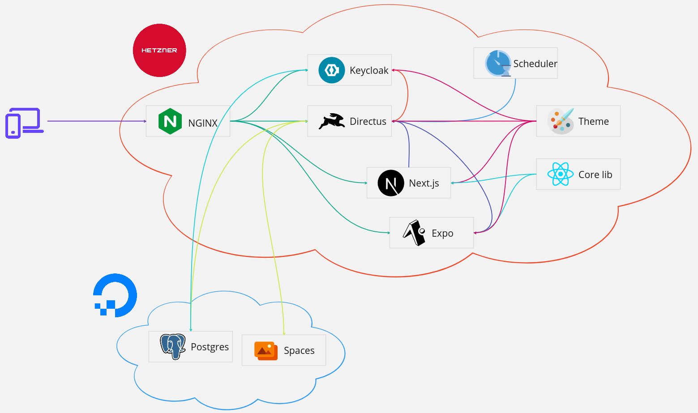

# Architecture


## Tooling
| Tooling     | Tools used                                             |
| ----------- | ------------------------------------------------------ |
| Language    | **Typescript** primarily. Python, bash for scripting   |
| Deployments | Automatic deployments with Docker and GitHub Workflows |
| Monorepo    | Turborepo                                              |
| Secrets     | Github secrets                                         |

<hr />

## Folder structure
```
├── apps
│   ├── keycloak-theme
│   ├── mobile
│   └── web
├── packages
│   ├── core-lib
│   └── theme
├── infra
│   ├── keycloak
│   ├── nginx
│   └── certbot
├── scripts
│   ├── docker-init-scripts
│   └── misc
└── directus
```

## Apps
- ### web (Next.js)
  - Built on top of react which is the foundation of our techstack. Our tech stack is based on react. We use react for both web as well as the mobile app.
  - Fullstack framework, allowing us to create API routes. We have decided to use next.js for building API's because it was easier than extending directus to support custom endpoints.
  - Builtin transpiler to transpile react native modules for the web to share code across the project.
- ## mobile (Expo)
  - Built on top of react native, offering a much better developer experience. As of May 15, 2024 Expo is the [recommended](https://reactnative.dev/docs/environment-setup) way of creating a new react native project.
  - Deployment to play store and app store with [EAS](https://expo.dev/eas)
- ## keycloak-theme
  - Clone of this amazing project - [keywind](https://github.com/lukin/keywind)
  - Application to build a custom login theme for keycloak.

## Packages
- ## core-lib
  - The actual codebase powering both next.js and expo applications in the `apps` folder. Written using **react native** and transpiled to react native web when used in next.js
  - Amazing code sharing, we export modules from this package and import it in both the web and mobile apps.
  - ## Key design choices
    - CSS: [NativeWind](https://github.com/nativewind/nativewind)
      > NativeWind uses Tailwind CSS as scripting language to create a universal style system for React Native. NativeWind components can be shared between platforms and will output their styles as CSS StyleSheet on web and StyleSheet.create for native.
    - UI: [React Native Reusables](https://github.com/mrzachnugent/react-native-reusables)
      > Crafted with NativeWind v4 and accessibility in mind, react-native-reusables is open source, offering a foundation for developing your own high-quality component library.
- ## theme
  - Theme config saved as JSON file.
  - script file in TS with `postcss` to automatically transform the theme in our `JSON` file to `CSS` file

## [directus](directus.io)
  > The backend to build anything or everything. Combining the utility of a Headless CMS with the power of a Backend-as-a-Service, Directus handles APIs, Auth, Admin, and more so you can focus on building amazing apps and websites
  
## infra
- Keycloak
  > Add authentication to applications and secure services with minimum effort. No need to deal with storing users or authenticating users. Keycloak provides user federation, strong authentication, user management, fine-grained authorization, and more.
- Nginx
  > NGINX is open-source web server software used for reverse proxy, load balancing, and caching. It provides HTTPS server capabilities and is mainly designed for maximum performance and stability.

## scripts
- `docker-init-scripts` folder contains bash files to be used with `Dockerfile`'s
- `misc` folder for handy python scripts to automate few stuffs