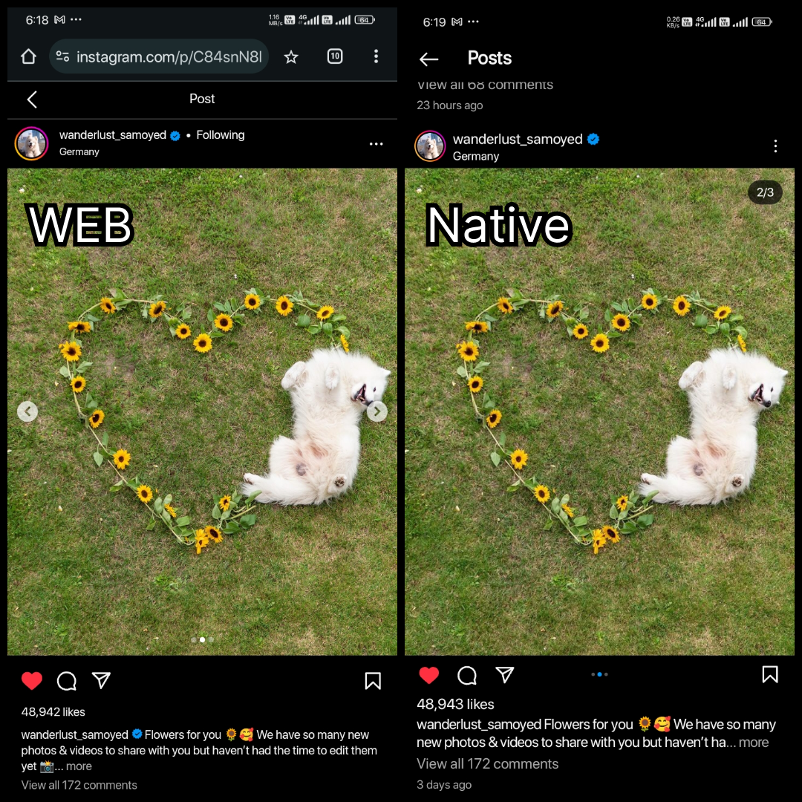
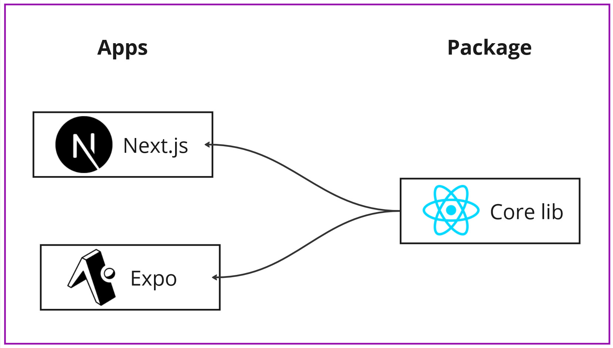

# Seamless UI Across Platforms: React, Next.js, and Expo Strategies

User Interface (UI) design plays a pivotal role in crafting user experiences that are intuitive, visually appealing, and functional. Take a look at [instagram](https://instagram.com) for example,

I could not find if instagram uses the same or similar component for their web and app version. Having a similar design for both a mobile app and a website helps save costs and makes it easier to maintain. It means using the same layout and style on both platforms, which makes it simpler for users since they already know how everything works. You can read more [here](https://qr.ae/psjWud)

## Methodology

We leverage the flexibility of **React as a library**, not a framework. Get comfortable with monorepo frameworks such as `turborepo`. The `core lib` package contains all the shared UI components of the application.



Consider screens as the fundamental building blocks of the application. Each platform implements how these screens are displayed. The platform acts as the skeleton, ready to render screens as needed. On iOS and Android, these shared screens are implemented using stacks, tabs, and drawers from React Navigation, giving you full control over navigation and animations. For a React Native developer, this is a familiar approach. Meanwhile, on Next.js, the shared screen components are rendered inside the app folder as usual.

### To summarize

1. **Core UI Components**: Have all your core UI components and screens in a package outside of the Next.js and Expo apps.
   ```tsx
   // packages/app/screens/foobar.tsx
   export default function Foobar() {
       return (
           <View>
               <Text>Foobar</Text>
           </View>
       );
   }
   ```
2. **Usage in Next.js**: Use the shared components in your Next.js app like this:
   ```tsx
   // apps/next/src/app/foobar/page.tsx
   export { Foobar as default } from "app/screens/foobar";
   ```
3. **Usage in Expo**: Use the shared components in your Expo app like this:
   ```tsx
   // apps/expo/app/foobar/index.tsx
   export { Foobar as default } from "app/screens/foobar";
   ```
By organizing your components and screens this way, you can maintain a clean and efficient codebase, making it easier to manage and scale your applications across different platforms.


*The above architecture requires some configurations to be made, please research in the internet for setting up this*